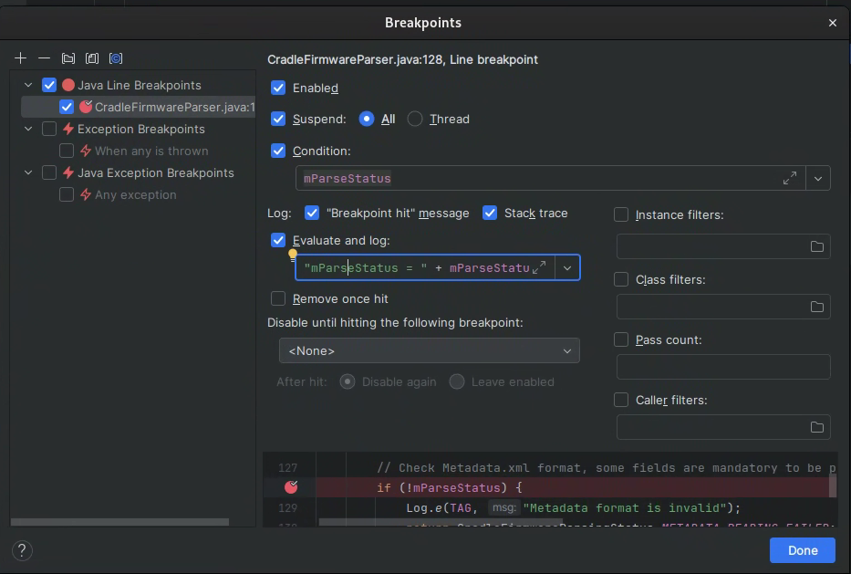
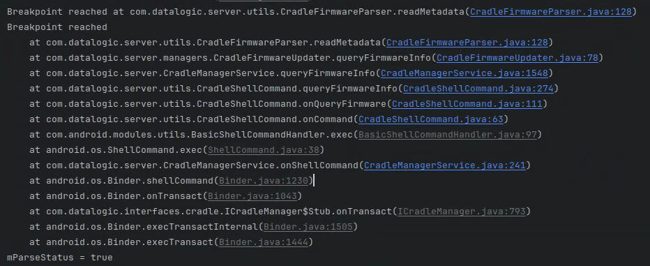
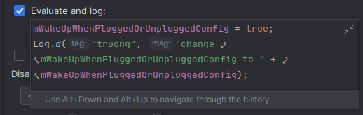

# Android Studio Debugger
**Android Studio** attaches to a running process on the device through **JDWP** (Java Debug Wire Protocol) over `adb`. The same debugger works for a normal **app process** and for a **system / server process** such as `system_server`; only the way the process is made debuggable is different.

```text
   Android Studio                 adb (host)              Android device
   ------------                   ---------               --------------
   Debugger  <--- JDWP --->  adb forward jdwp:<pid>  <--->  process (app / system_server)
```

## 1. Prepare the Device
> A **userdebug** or **eng** build is required. A **user** build does not expose system processes to the debugger.

```bash
adb root
adb shell setprop persist.debug.dalvik.vm.jdwp.enabled 1
adb shell setenforce 0                     # Optionally set permissive SELinux, if access is denied
adb shell setprop dalvik.vm.usejit false   # Optionally disable JIT so breakpoints always hit
adb reboot
```
| Command | Description |
| --- | --- |
| `setenforce 0` | Set SELinux to permissive mode. Useful if access is denied. Persists until the next reboot. |
| `persist.debug.dalvik.vm.jdwp.enabled 1` | Open a JDWP port on **every** process, including system processes. Persists across reboots. |
| `dalvik.vm.usejit false` | Disable JIT so breakpoints always hit. Persists until the next reboot. |

## 2. Debug an App Process
The simplest case: the source code of the app is open in Android Studio.

### 2.1 Run in Debug Mode
Build and start the app directly from the IDE.
- Press **Debug** (the bug icon)
- Android Studio installs the APK, launches it, and attaches the debugger automatically.

### 2.2 Attach to a Running App
Use this when the app is already installed, for example a prebuilt APK from the system image.
- Menu **Run > Attach Debugger to Android Process**.
- Pick the process from the list, then press **OK**.

> The app must be **debuggable**: either `android:debuggable="true"` in the manifest, a debug build, or a userdebug device with `persist.debug.dalvik.vm.jdwp.enabled` set.

## 3. Debug a System / Server Process
System services live inside processes started by `init` or forked from `zygote`. They cannot be launched from the IDE, so they are always **attached** to.

### 3.1 Find the Process
```bash
adb shell ps -A | grep system
```
| Process | Description |
| --- | --- |
| `system_server` | Hosts the AOSP framework services (`ActivityManagerService`, `PackageManagerService`, `PowerManagerService`, ...). Listed as **system_process** in the Java attach dialog. |
| `com.android.systemui` | System UI: status bar, navigation bar, quick settings. |
| `<vendor>.server` | A custom service process added by the platform, running its own APK or JAR. |
| `servicemanager` | Native C++ binder name-server. **Not** a Java process, so the Java debugger cannot attach to it. |

**Notice**: `system_server` is listed as `system_process` in the Java attach dialog. This is the expected behavior and does not indicate a separate process.


### 3.3 Open the Source as a Project
The debugger needs the **same source code** as the one built into the image.
- Open the module folder that contains the service (for example `frameworks/base` or the vendor service folder) as an Android Studio project.
- Keep the source tree at the **exact revision** used to build the image, otherwise breakpoints land on the wrong lines.

### 3.4 Attach
- Menu **Run > Attach Debugger to Android Process**.
- Tick **Show all processes** so that system processes appear.
- Select `system_process` (for `system_server`) or the vendor server process.
- Choose the **Java Debugger** configuration, then press **OK**.

> If the process list is empty, the device is not rooted or `persist.debug.dalvik.vm.jdwp.enabled` was not applied. Repeat step 1 and reboot.

> `system_server` restarts the device when it is paused for too long (watchdog). Keep breakpoint pauses short, or use non-suspending breakpoints (section 4).

## 4. Breakpoints
Click the gutter next to a line to set a breakpoint, then right-click it and choose **More** to open the settings dialog.



| Option | Description |
| --- | --- |
| `Enabled` | Turn the breakpoint on or off without deleting it. |
| `Suspend: All` | Pause every thread when the line is reached. |
| `Suspend: Thread` | Pause only the thread that reached the line. |
| `Suspend` (unchecked) | Do **not** pause. The process keeps running and only the logs below are printed. |
| `Condition` | Pause only when the expression is `true`, for example `mParseStatus` or `id == 5`. |
| `"Breakpoint hit" message` | Print a line in the debugger console every time the breakpoint is reached. |
| `Stack trace` | Print the full call stack that led to this line. |
| `Evaluate and log` | Run an expression and print its result. See section 5. |
| `Remove once hit` | Delete the breakpoint after the first hit. |
| `Pass count` | Pause only after the line has been reached N times. |

> Unchecking **Suspend** and enabling **Stack trace** turns a breakpoint into a **log point**. This is the safest way to trace `system_server`, because the process is never paused.

The output appears in the **Debug > Console** tab.



## 5. Evaluate and Log
**Evaluate and log** runs Java code at the breakpoint, so a variable can be changed and a log printed **without rebuilding the source**.



```java
mWakeUpWhenPluggedOrUnpluggedConfig = true;
Log.d("truong", "change mWakeUpWhenPluggedOrUnpluggedConfig to " + mWakeUpWhenPluggedOrUnpluggedConfig);
```
| Use case | Example |
| --- | --- |
| Force a code path | `isPassed = false;` |
| Print a value | `"mParseStatus = " + mParseStatus` |
| Print a value and continue | `Log.d("TAG", "value = " + value);` |

> Statements are separated by `;`. The value of the **last** expression is printed in the console.

*Inspect values while paused*
- **Variables** panel: shows every local field at the current line.
- **Evaluate Expression** (**Alt + F8**): run any expression against the paused state.

## 6. Stack Trace from Code
When the debugger cannot be attached, print the call stack directly from the source and read it with `adb logcat`.

```java
Slog.d("TRACE_FLOW", Log.getStackTraceString(new Throwable()));
Thread.dumpStack();
```
| Call | Description |
| --- | --- |
| `Log.getStackTraceString(new Throwable())` | Returns the current call stack as a `String`, ready to log with any tag. |
| `Thread.dumpStack()` | Prints the current call stack to the log under the `System.out` tag. |

```bash
adb logcat -s TRACE_FLOW
```

