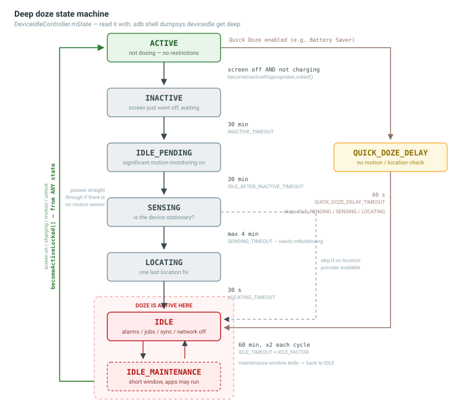

# Battery Debug — Doze Mode
**Doze** puts the device to sleep after the screen has been off for a while, to save battery. While dozing, the system defers alarms, jobs, syncs and network access, and **ignores wake locks**.

Doze runs on two independent state machines, both owned by `DeviceIdleController`.

| Level | Entry condition | Effect |
| --- | --- | --- |
| **Light doze** | Screen off + not charging | Defers jobs and syncs, restricts network for background apps. Reaches `IDLE` ~4 min after the screen goes off. |
| **Deep doze** | Screen off + not charging + **stationary** (no motion) | Full restrictions: alarms, jobs, syncs, network, wake locks. Takes ~1 hour of no motion. |



> Device go through several states before actually entering doze. 
> Only **`IDLE`** and **`IDLE_MAINTENANCE`** (the red zone) are actually "in doze". Everything before that is just waiting and checking conditions — no restriction is applied yet. Timings are the AOSP defaults; a vendor build can override them.

## 1. What to Check First
### 1.1 `dumpsys battery` — is the device really unplugged?
Doze **never starts while charging**. This is the most common reason a doze test does nothing.
```bash
adb shell dumpsys battery
```
| Field | What to look for |
| --- | --- |
| `AC powered` / `USB powered` / `Wireless powered` | All must be `false`. Any `true` keeps the device in `ACTIVE`. |
| `status` | `2` = charging, `3` = discharging, `5` = full. Needs to be `3`. |
| `level` | Battery percentage. |
| `(UPDATES STOPPED -- use 'reset' to restart)` | The battery state is **frozen** by a previous `unplug` / `set`. Always `reset` when done testing. |

### 1.2 `dumpsys deviceidle` — which doze state is the device in?
```bash
adb shell dumpsys deviceidle | grep -E "mState|mLightState|mScreenOn|mCharging|mForceIdle|mNotMoving"
```
| Field | Meaning |
| --- | --- |
| `mState` | Deep doze state: `ACTIVE`, `INACTIVE`, `IDLE_PENDING`, `SENSING`, `LOCATING`, `IDLE`, `IDLE_MAINTENANCE`, `QUICK_DOZE_DELAY`. |
| `mLightState` | Light doze state: `ACTIVE`, `INACTIVE`, `IDLE`, `WAITING_FOR_NETWORK`, `IDLE_MAINTENANCE`, `OVERRIDE`. |
| `mScreenOn` / `mCharging` | The two entry conditions. Both must be `false` to leave `ACTIVE`. |
| `mForceIdle` | `true` when doze was forced by `force-idle`, not reached naturally. |
| `mLightEnabled` / `mDeepEnabled` | `false` means doze is disabled on this build — nothing will ever happen. |
| `mNextAlarmTime` | When the next state step is scheduled. |
| `mActiveIdleOpCount` / `mJobsActive` / `mAlarmsActive` | Non-zero / `true` blocks the step into `IDLE`. |

*Short form*
```bash
adb shell dumpsys deviceidle get deep     # deep doze state
adb shell dumpsys deviceidle get light    # light doze state
adb shell dumpsys deviceidle get charging # charging state
adb shell dumpsys deviceidle get screen   # screen state
```

### 1.3 `dumpsys power` — which wake lock is holding the device awake?
A **partial wake lock** keeps the CPU running and prevents the device from going to sleep. This is the usual culprit for battery drain.
```bash
adb shell dumpsys power | grep -A 20 "Wake Locks:"
```
```text
Wake Locks: size=2
  PARTIAL_WAKE_LOCK      'AudioMix'          ACQ=-2m5s331ms (uid=1041)
  PARTIAL_WAKE_LOCK      'MyAppSyncTask'     ACQ=-15m2s110ms (uid=10234, pid=5566)
```
| Keyword | Meaning |
| --- | --- |
| `PARTIAL_WAKE_LOCK` | CPU stays on, screen may be off. **The one that drains battery.** |
| `FULL_WAKE_LOCK` / `SCREEN_BRIGHT_WAKE_LOCK` | Screen stays on. Deprecated for apps. |
| `ACQ=` | How long the lock has been held. A long value on a background app is the problem. |
| `uid=` / `pid=` | Owner of the lock. `uid >= 10000` is a normal app. |
| `mWakefulness=` | `Awake`, `Dozing`, `Asleep`. |
| `mDeviceIdleMode=` / `mLightDeviceIdleMode=` | `true` when deep / light doze restrictions are active. |

> Once deep doze reaches `IDLE`, partial wake locks are **ignored** by the system. So a wake lock cannot break doze, but it does drain battery during all the time before doze starts.

*Wake lock totals over time*
```bash
adb shell dumpsys batterystats | grep -A 20 "All partial wake locks"
```

## 2. Force Doze for Testing
Waiting ~30 minutes for real doze is impractical. Force it instead.
```bash
adb shell dumpsys battery unplug          # pretend the cable is not connected
adb shell dumpsys deviceidle force-idle   # jump straight into deep doze
adb shell dumpsys deviceidle get deep     # -> IDLE
```

*Step through the states one by one instead of jumping*
```bash
adb shell dumpsys deviceidle force-inactive
adb shell dumpsys deviceidle step deep     # run repeatedly: INACTIVE -> IDLE_PENDING -> ... -> IDLE
adb shell dumpsys deviceidle step light
```

*Restore the device*
```bash
adb shell dumpsys deviceidle unforce
adb shell dumpsys battery reset
```
> `dumpsys battery reset` is required. Forgetting it leaves the battery state frozen until reboot.

| Command | Description |
| --- | --- |
| `deviceidle force-idle [light\|deep]` | Enter idle immediately, ignoring motion and screen state. |
| `deviceidle force-inactive` | Go to `INACTIVE`, ready to `step` manually. |
| `deviceidle step [light\|deep]` | Advance one state without waiting for the alarm. |
| `deviceidle unforce` | Return control to the normal state machine. |
| `deviceidle disable [light\|deep\|all]` | Turn doze off completely. |
| `deviceidle enable [light\|deep\|all]` | Turn doze back on. |
| `deviceidle motion` | Simulate motion to wake the device out of deep doze. |

## 3. Whitelist (Battery Optimization Exemption)
A whitelisted app is not restricted by doze. Check this before blaming the app's code.
```bash
adb shell dumpsys deviceidle whitelist              # print the current whitelist
adb shell dumpsys deviceidle whitelist +<package>   # add <package> to the whitelist
adb shell dumpsys deviceidle whitelist -<package>   # remove <package> from the whitelist
adb shell dumpsys deviceidle tempwhitelist          # apps temporarily exempted (e.g. after a push message)
```
> In the UI this is **Settings > Apps > *app* > Battery > Unrestricted**.

## 4. Battery Historian
Visualizes battery usage, wake locks and doze windows on a timeline.
```bash
adb bugreport bugreport.zip
```
Upload `bugreport.zip` to Battery Historian. Useful rows: **CPU running**, **Partial wakelock**, **Doze**, **Job**, **Sync**.

*Reset the counters before starting a measurement*
```bash
adb shell dumpsys batterystats --reset
```
