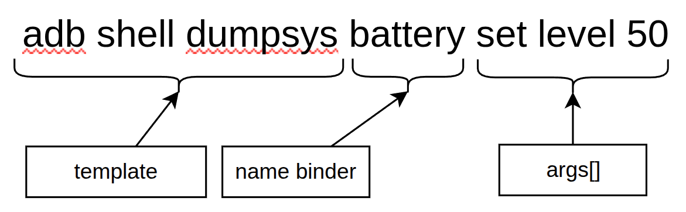
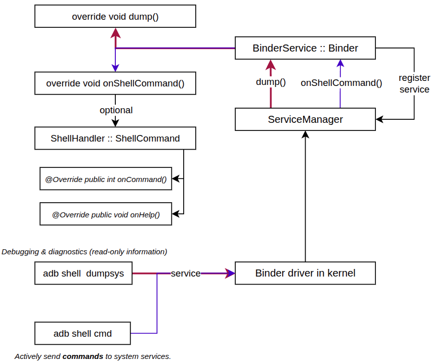
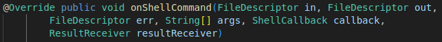

# dumpsys

`dumpsys` is a command line tool that prints the internal state of the system services running on a device.

Almost every system service keeps its own state, counters and recent history, and exposes them through `dumpsys`. That makes it the first place to look when debugging: instead of adding logs and rebuilding, you can read what the service already knows.

A bug report (`adb bugreport`) is mostly a dump of every service collected at once, so knowing `dumpsys` also means knowing how to read a bug report.

## Basic commands

List every service that can be dumped:

```
adb shell dumpsys -l
```

Pick one device when more than one is connected:

```
adb shell dumpsys <service>
```

Pass arguments to a service, when it supports them:

```
adb shell dumpsys package com.example.app
adb shell dumpsys meminfo com.example.app
```

## Anatomy of a command



A `dumpsys` call is made of three parts:

| Part | Example | Meaning |
| --- | --- | --- |
| tool | `adb shell dumpsys` | the tool that talks to the service |
| service name | `battery` | the name the service registered in ServiceManager |
| arguments | `set level 50` | free text passed to the service as `String[] args` |

The service name is the important one. It is the name used when the service was published, not the Java class name, and it is exactly what `dumpsys -l` prints.

## How it works



1. A system service registers itself in `ServiceManager` under a name.
2. `adb shell dumpsys` asks `ServiceManager` for that name and gets a binder handle.
3. The call goes through the binder driver in the kernel to the service process.
4. Binder delivers it to the service as a `dump()` call.
5. The service writes its state into the `PrintWriter`, and the text travels back to the terminal.

Everything is a normal binder transaction, so the output is produced live by the service itself. It is the real current state, not a cached snapshot.

## The dump() method


This is the method a service overrides to answer `dumpsys`:

- `FileDescriptor fd` - the raw output stream, rarely used directly
- `PrintWriter pw` - where the service writes its text, for example `pw.println("Speed: " + speed);`
- `String[] args` - the extra words typed after the service name

If the service ignores `args`, `dumpsys <service>` always prints the same full dump. If it parses them, the arguments can select a section or a package, like `dumpsys package com.example.app`.

Guidelines when writing a `dump()`:

- Keep it read-only, it can be called at any time, including during a bug report.
- Keep it short and grouped, one section per feature.
- Do not print secrets such as keys, passwords or full identifiers.

## dumpsys and cmd

`dumpsys` and `cmd` both reach a service through binder, but they land on different methods and serve different purposes.

| | `dumpsys` | `cmd` |
| --- | --- | --- |
| Command | `adb shell dumpsys <service> [args]` | `adb shell cmd <service> <args>` |
| Method called | `dump()` | `onShellCommand()` |
| Purpose | debugging and diagnostics | interact with the service, set and get |
| Expected effect | read-only | changes the state of the service |



`onShellCommand()` receives separate input, output and error streams, because a command can read input and report failures, not only print a report.

Most services do not parse the arguments themselves. They hand them to a `ShellCommand` helper class, which splits the arguments and calls back:

- `onCommand(String cmd)` - runs one sub-command and returns an exit code
- `onHelp()` - prints the usage text, shown by `adb shell cmd <service> help`

List the services that accept commands with:

```
adb shell cmd -l
adb shell cmd <service> help
```

One exception is worth knowing: a few services, such as the battery service, also parse arguments inside `dump()`. That is why `adb shell dumpsys battery set level 50` changes the reported battery level even though it goes through the read-only path. Treat it as a legacy shortcut, new code should put actions in `onShellCommand()`.

## Services used often

| Service | What it shows |
| --- | --- |
| `activity` | activity stacks, processes, broadcasts, services |
| `package` | installed packages, permissions, intent filters |
| `window` | windows, displays, focus, rotation |
| `battery` | level, status, charging source, temperature |
| `power` | wake locks, screen state, doze |
| `alarm` | scheduled and pending alarms |
| `wifi` | connection state, scan results, saved networks |
| `connectivity` | active networks, routes, validation |
| `meminfo` | memory used per process |
| `cpuinfo` | recent CPU usage per process |
| `input` | input devices and event dispatch |
| `notification` | posted notifications and their channels |
| `jobscheduler` | jobs waiting and their constraints |
| `SurfaceFlinger` | layers, buffers, display composition |

A fast way to find the right one is to run `adb shell dumpsys -l`, then dump the candidate and search its output.
