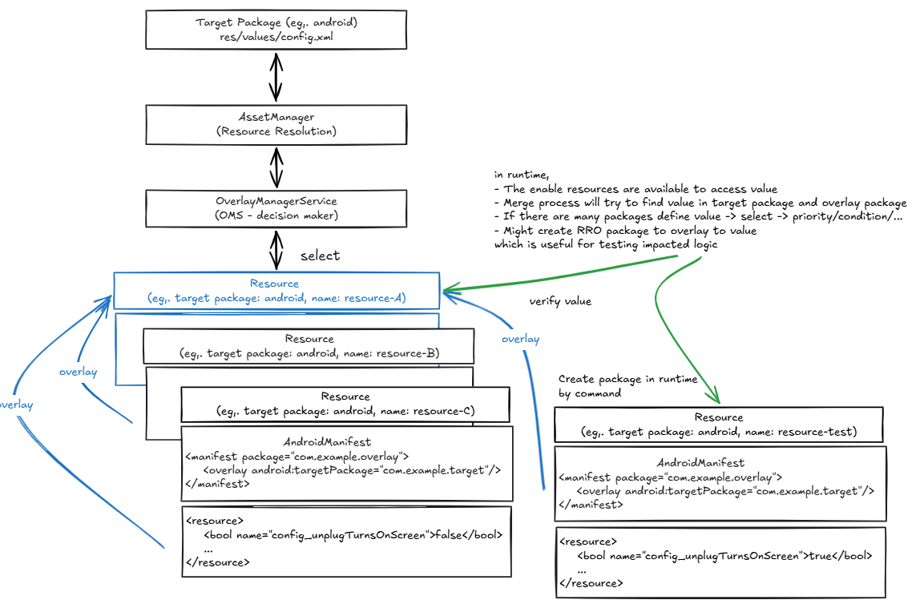
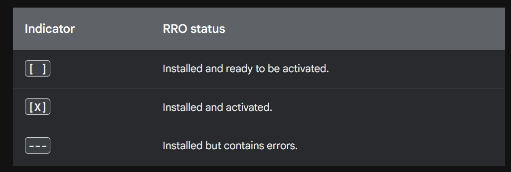
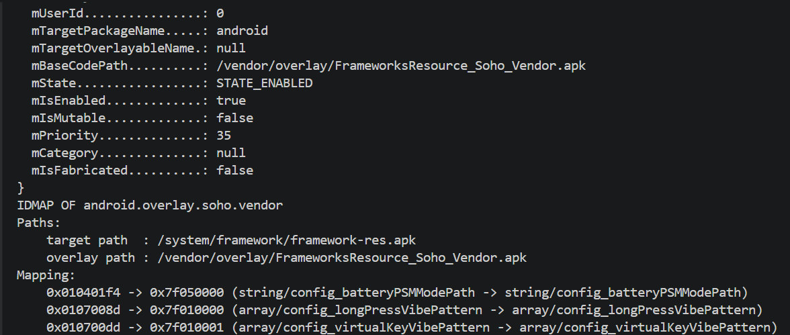

# Runtime Resource Overlay (RRO)
An **RRO** is an APK that contains **only resources** and no code. It replaces the value of a resource in a **target package** at runtime, so a config value can be changed **without rebuilding the target**.

The typical use is a vendor customization of `framework-res.apk` (target package `android`): the same AOSP build ships to several devices, and each device overlays its own values.

## 1. How It Works


| Piece | Role |
| --- | --- |
| **Target package** | Owns the original resource, for example `android` → `res/values/config.xml`. Apps always reference the **target** resource ID (`android.R.bool.config_...`), never the overlay. |
| **Overlay package** | An APK declaring `<overlay android:targetPackage="...">`. Its resources are merged into the target at runtime. |
| **OverlayManagerService (OMS)** | Decides **which** overlays are enabled for a user and in what order. |
| **idmap** | The generated table mapping *overlay resource ID → target resource ID*. Built by `idmap2` and stored in `/data/resource-cache/`. No idmap means the overlay does nothing. |
| **AssetManager** | Resolves the value at lookup time, walking the enabled overlays from **lowest to highest priority**. |

Key points for debugging:
- The resource is always read through the **target** package name. Verify there, not on the overlay package.
- If several overlays define the same resource, the one with the **highest priority is applied last** and therefore wins.
- Overlay resources are still readable on their own, which is useful to confirm an overlay really carries the value.

## 2. Manifest Attributes
```xml
<manifest xmlns:android="http://schemas.android.com/apk/res/android"
          package="com.example.overlay">
    <application android:hasCode="false" />
    <overlay
        android:targetPackage="android"
        android:targetName="MyOverlayableName"
        android:isStatic="false"
        android:priority="1" />
</manifest>
```
| Attribute | Description |
| --- | --- |
| `android:targetPackage` | **Required.** Package name of the app being overlaid. |
| `android:targetName` | Name of the `<overlayable>` block in the target's `res/values/overlayable.xml`. **Required when the target declares one**, otherwise the overlay is rejected. |
| `android:isStatic` | `true` = always on, enabled at boot and cannot be toggled. `false` = dynamic, toggled with `cmd overlay`. |
| `android:priority` | Higher value wins. Only meaningful for static overlays. |
| `android:requiredSystemPropertyName` | Apply the overlay only when this system property matches. |
| `android:requiredSystemPropertyValue` | The value the property must have. Useful for one image covering several SKUs. |

> `android:hasCode="false"` is required. An RRO has no `classes.dex`, and without this the package fails to install.

## 3. Static vs Dynamic
| | Static | Dynamic |
| --- | --- | --- |
| Enabled at boot | Yes, always | No, must be enabled |
| Toggle at runtime | No | Yes, `cmd overlay enable` / `disable` |
| Priority | From `android:priority` | Always `Integer.MAX_VALUE`, so it wins over static ones |
| Install location | Must be preinstalled in `/vendor/overlay` ... | Can be installed with `adb install` |

> Only **dynamic** overlays can be turned on and off while the device runs, which makes them the practical choice for testing.

## 4. Inspect the Current State
### 4.1 `overlay list` — which overlays exist and which are on
```bash
adb shell cmd overlay list                    # all users
adb shell cmd overlay list --user current     # current user only
adb shell cmd overlay list --user 0 android   # only overlays targeting "android"
```
Output is grouped by target package, with a status indicator in front of each overlay.



> `---` means the overlay is installed but its **idmap failed**. That is the usual sign of a wrong `targetPackage`, a missing `targetName`, or a resource that does not exist in the target.

### 4.2 `overlay dump` — full details and the idmap
```bash
adb shell cmd overlay dump                            # everything
adb shell cmd overlay dump <overlay package>          # one overlay
adb shell dumpsys overlay                             # same data through dumpsys
```


| Field | What to look for |
| --- | --- |
| `mTargetPackageName` | The package being overlaid. Must match the app that reads the resource. |
| `mState` / `mIsEnabled` | `STATE_ENABLED` + `true` means it is applied. Anything else means it is not. |
| `mPriority` | Higher wins. Compare when two overlays fight over the same resource. |
| `target path` / `overlay path` | The two APKs the idmap was built from. |
| `Mapping` | `overlay resource ID -> target resource ID`. **If the resource is not listed here, the overlay is not overriding it.** |

Common `mState` values:

| State | Meaning |
| --- | --- |
| `STATE_ENABLED` | Applied. |
| `STATE_DISABLED` | Installed and valid, but off. |
| `STATE_MISSING_TARGET` | The target package is not installed. |
| `STATE_NO_IDMAP` | The idmap could not be generated. Check the target name and the resource names. |

### 4.3 `overlay lookup` — read the value actually in effect
```bash
adb shell cmd overlay lookup [--verbose] [--user 0] <package name> <package name>:<type>/<resource name>
```
```bash
# value in effect, asked on the TARGET package
adb shell cmd overlay lookup --user 0 android android:bool/config_show_status_banner

# value stored inside the overlay itself, to confirm the overlay carries it
adb shell cmd overlay lookup --user 0 android.overlay.soho.vendor android.overlay.soho.vendor:bool/config_support_psm_mode
```
## 5. Change a Value at Runtime
The quickest way to test the impact of a config value: no build, no APK, no signing.

**Step 1 — read the current value**
```bash
adb shell cmd overlay lookup android android:bool/config_show_status_banner
```

**Step 2 — create a fabricated overlay**
```bash
adb shell cmd overlay fabricate --target <target package> --name <new name> <target package>:<type>/<resource> <type ID> <value>
```
```bash
adb shell cmd overlay fabricate --target android --name android.soho.test android:bool/config_show_status_banner 0x12 0x0
```
| Type | Type ID | Value format |
| --- | --- | --- |
| `string` | `0x03` | plain string |
| `bool` | `0x12` | `0x1` (true) / `0x0` (false) |
| `int` | `0x10` | hex integer |
| `color` | `0x1c` | ARGB, for example `0xff0000ff` |

**Step 3 — enable it**
```bash
adb shell cmd overlay enable com.android.shell:android.soho.test
```
> A fabricated overlay is always owned by **`com.android.shell`**, so its package name is `com.android.shell:<name>`. The file is written under `/data/misc/frro/<user id>/` and survives reboot, so disable it when the test is finished.

**Step 4 — read the value again**
```bash
adb shell cmd overlay lookup --verbose android android:bool/config_show_status_banner
```
> Most framework config values are read **once**, at boot or when the service starts. If the new value has no effect, restart the reader: `adb shell stop && adb shell start`, or restart the app.

**Step 5 — clean up**
```bash
adb shell cmd overlay disable com.android.shell:android.soho.test
```

## 6. Other Useful Commands
*Control which overlay wins*
```bash
adb shell cmd overlay enable  [--user 0] <package>
adb shell cmd overlay disable [--user 0] <package>
adb shell cmd overlay enable-exclusive [--category] <package>    # enable it and turn every other overlay of the target off
adb shell cmd overlay set-priority <package> <highest|lowest|parent package>
```

*Find the files on the device*
```bash
adb shell ls -l /vendor/overlay /product/overlay /system/overlay   # preinstalled RRO APKs
adb shell ls -l /data/resource-cache/                              # generated idmap files
adb shell ls -l /data/misc/frro/0/                                 # fabricated overlays
adb shell pm path <overlay package>                                # where an installed overlay lives
adb shell pm list packages | grep overlay
```

*Watch why an overlay is rejected*
```bash
adb logcat -s OverlayManagerService idmap2 OverlayManagerServiceImpl
```
> Keep this running while enabling an overlay. A rejected overlay prints the reason here, which the `list` output does not show.

*Host side, before flashing*
```bash
aapt2 dump xmltree overlay.apk --file AndroidManifest.xml   # check targetPackage / targetName
aapt2 dump resources overlay.apk                            # check the resources really are in the APK
```

## 7. Build an RRO APK
`AndroidManifest.xml`
```xml
<manifest xmlns:android="http://schemas.android.com/apk/res/android"
          package="com.example.overlay">
    <application android:hasCode="false" />
    <overlay
        android:targetPackage="android"
        android:isStatic="false"
        android:priority="1" />
</manifest>
```
`res/values/config.xml` — the resource **name and type must match the target exactly**.
```xml
<resources>
    <bool name="config_show_status_banner">true</bool>
</resources>
```
Install and enable:
```bash
adb install -r overlay.apk
adb shell cmd overlay enable com.example.overlay
```
> The APK must be **signed**. An overlay of a system package generally has to be signed with the **platform key** of the build, or be preinstalled in `/vendor/overlay`. A debug-signed APK installs, but is usually not allowed to overlay `android`.

## 8. Troubleshooting
| Symptom | Likely cause |
| --- | --- |
| Overlay missing from `cmd overlay list` | Not installed, or installed for a different user. Check `pm path` and `--user`. |
| Shown as `---` / `STATE_NO_IDMAP` | Wrong `targetPackage`, missing `targetName`, or the resource does not exist in the target. Check `logcat -s idmap2`. |
| `lookup` shows the new value, the device behaves the same | The value was cached at boot. Restart the process, or `adb shell stop && adb shell start`. |
| Resource missing from the `Mapping` list in `dump` | The resource name does not match the target. A typo creates a *new* resource instead of an override. |
| Cannot disable the overlay | It is static (`mIsMutable: false`). Only a different build can change it. |
