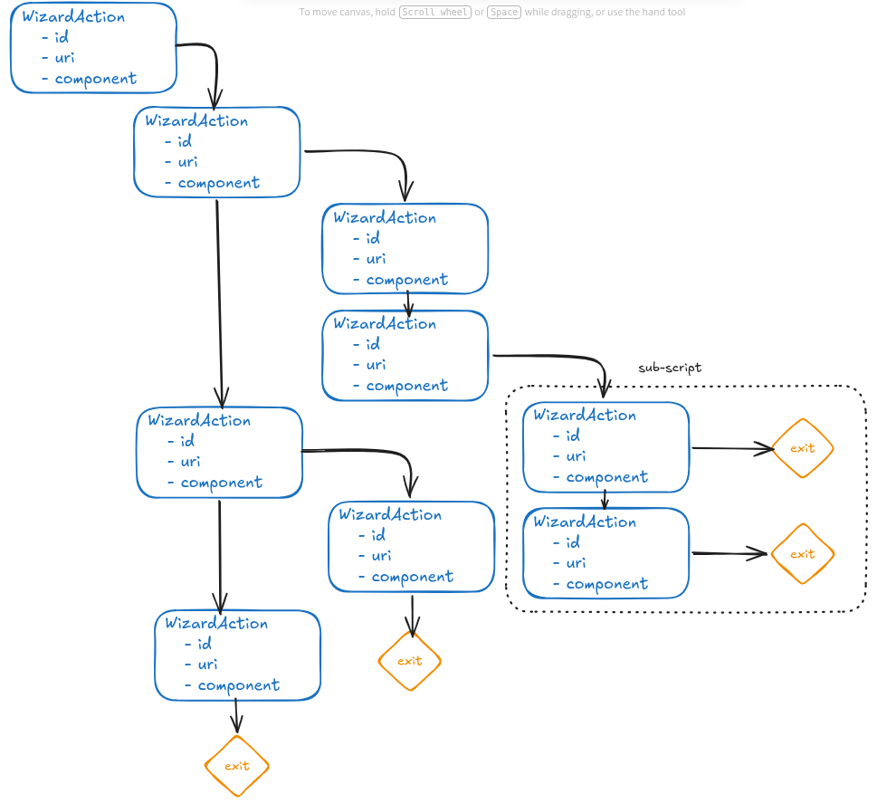

# Setup Wizard

Setup Wizard is the setup flow that runs after the first boot or after a factory reset.

Each step of the flow is one activity. For example:

- Set up Google account
- Set up Wi-Fi
- Restore data from another device

## The wizard script

The whole flow is defined in an XML resource:

```
qssi15/vendor/partner_gms/apps/GmsSampleIntegration/res/raw/wizard_script.xml
```

A step can jump into a sub-script, which is just another XML file with the same format:

```
qssi15/vendor/partner_gms/apps/GmsSampleIntegration/res/raw/wizard_script_qr_provision_flow.xml
```

Each step in the script is a `WizardAction` tag, and the steps are chained one after another until the flow reaches an exit.



## WizardAction

A `WizardAction` describes one step and how to launch its activity. The main attributes are:

- `id` - the name of the step, used to jump to it
- `action` - the intent action to send
- `component` - the exact activity to start, when the step does not rely on an action
- `uri` - an intent written as a URI, which also carries the action and its extras

## Setup Wizard changes activity by action

Setup Wizard does not start activities directly by class name most of the time. It builds an intent from the `action` of the current `WizardAction` and sends it, so Android resolves which activity handles that action.

The flow works like this:

1. Setup Wizard reads the current `WizardAction`.
2. It builds an intent from `action`, or from `uri`, or from `component`.
3. It starts the matching activity and waits.
4. The activity finishes and returns a result code.
5. Setup Wizard uses that result to decide the next step, then repeats.

The result code decides the direction. A normal finish moves to the next `WizardAction`, a skip result jumps over the step, and a cancel result goes back to the previous one. `exit` in the diagram means the script ends there.

Using an action instead of a fixed component is what makes the flow flexible. Any application that declares an intent filter for that action can serve the step, so the same script can run on different devices and builds.

## OEM customization

An OEM can customize Setup Wizard by inserting its own `WizardAction` between existing steps. The inserted step points to an OEM activity, so the user must complete that screen before the flow continues.
