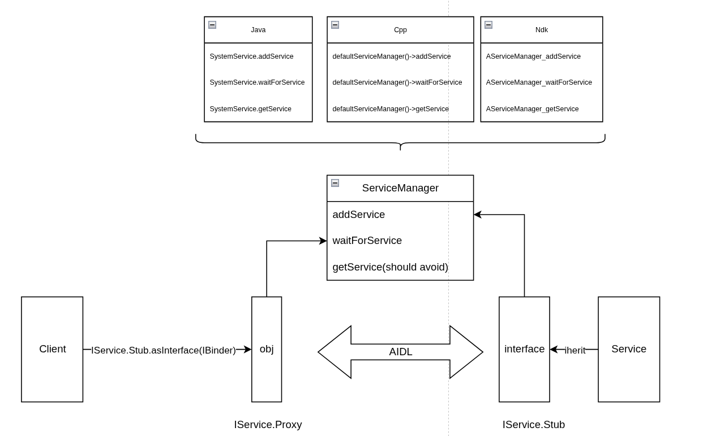

# AIDL (Android Interface Definition Language)

## 0. Quick reference
| Command | Description |
| --- | --- |
| m <interface_name>-update-api | Update the current API version |
| m <interface_name>-freeze-api | Freeze the API at the current version |
| m <interface_name>-V1-ndk | Build the NDK backend for version 1 |

Generated code: 
```text
soong/.intermediates/<interface-name>/aidl/
```

Find the generated AIDL code:
| Language | Generated code location |
| --- | --- |
| Java | `gen/android/example/IFoo.java` |
| C++ | `gen/include/android/example/IFoo.h`, **BnFoo.h**, **BpFoo.h**, plus the `.cpp` in `gen/` |
| NDK | `gen/include/aidl/android/example/IFoo.h`, **BnFoo.h**, **BpFoo.h**, plus the `.cpp` in `gen/` |
| Rust | `gen/rust/android/example/IFoo.rs` |

**Notice: Update API to freeze version** 
``` text
1. Modify AIDL interface 
2. Run "m update-api" to update new api to folder "current" 
3. Remove folder version "1" 
4. Copy folder "current" to version "1" 
5. Rebuild 
```

## 1. How It Works

**AIDL** describes an interface that can be called **across process boundaries**. You write a `.aidl` file, the build generates the marshalling code for both sides, and the two processes talk through **binder**.

You never write the parcel read/write code yourself. That is the whole point: the `.aidl` file is the single source of truth, and the generated code keeps client and server in agreement.


| Piece | Role |
| --- | --- |
| **`.aidl` file** | The contract. Method names, parameter types, return types. |
| **`IFoo.Stub`** | Server side. An abstract binder object. The real service extends it and implements the methods. |
| **`IFoo.Proxy`** | Client side. Looks like the interface, but every call is packed into a `Parcel` and sent over binder. |
| **`ServiceManager`** | The name directory. A service registers under a name, a client looks the name up and receives a binder handle. |
| **Binder driver** | Kernel side. Carries the transaction between the two processes. |

The call path is always the same:
1. The service creates a `Stub` subclass and registers it in `ServiceManager` under a name.
2. The client asks `ServiceManager` for that name and gets an `IBinder`.
3. The client calls `IFoo.Stub.asInterface(binder)`, which returns a `Proxy`.
4. The return value travels back the same way.
> If the client and the service happen to live in the **same process**, `asInterface()` returns the real object directly, with no parcelling at all. That is why a bug can appear only when the service is moved out of process.

## 2. Implement AIDL interface module
## **Android.bp**
A stable, versioned interface is declared with the `aidl_interface` module type.
``` text
aidl_interface {
    name: "android.example.foo",
    srcs: ["android/example/*.aidl"], // Every .aidl file. The package must match the directory layout.

    vendor_available: true, // Who may link against it.
    product_available: true,
    host_supported: false,

    stability: "vintf", // "vintf" = crosses the system/vendor boundary, must be frozen.
    owner: "vendor",
    imports: ["android.example.common-V2"], // Other interfaces used by this one.

    // Backends to generate code for.
    backend: {
        java: {
            enabled: true,
            sdk_version: "module_current",
        },
        cpp: {
            enabled: false,
        },
        ndk: {
            enabled: true,
        },
        rust: {
            enabled: true,
        },
    },

    // Frozen versions, filled in by the freeze command.
    versions_with_info: [
        {
            version: "1",
            imports: ["android.example.common-V2"],
        },
    ],
    frozen: true,
}
```
| Property | What it controls |
| --- | --- |
| `srcs` | The `.aidl` files. Directory layout must match the `package` line. |
| `stability` | Empty means system-internal. `"vintf"` means it is a vendor interface and the compatibility rules are enforced. |
| `vendor_available` | Allows vendor modules to link against it. |
| `imports` | Other `aidl_interface` modules this one refers to, with their version. |
| `versions_with_info` | The frozen versions and what each one imported. Do not edit by hand. |
| `frozen` | `true` means no change is allowed to the current API without freezing a new version. |

## **Implement the Interface**
```java
package android.example;
import android.example.Result;
interface IFoo {
    int add(int a, int b);

    @nullable String getName(int id);

    oneway void notifyChanged(in Result r);
}
```

Direction and modifiers
| Modifier | Meaning |
| --- | --- |
| `in` | Copied from client to server. The default, and the only one allowed for primitives. |
| `out` | Filled by the server and copied back. Costs an extra copy. |
| `inout` | Both directions. |
| `oneway` | The call returns immediately and cannot return a value. Use it for notifications. |
> One method per line, and **never reorder or delete methods** once the interface is released. The transaction code of a method is its **position in the file**. See section 6.

## **Build or update interface**
| Command | Description |
| --- | --- |
| m <interface_name>-update-api | Update the current API version |
| m <interface_name>-freeze-api | Freeze the API at the current version |
| m <interface_name>-V1-ndk | Build the NDK backend for version 1 |

### Finding the Generated Source
Everything Soong generates lives under `out/soong/.intermediates/`
```
out/soong/.intermediates/<path to Android.bp>/<interface>-V<n>-<backend>-source/gen/
```

What each backend produces:
| Backend | Library name | Files |
| --- | --- |
| Java | `android.example.foo-V1-java` | `gen/android/example/IFoo.java`, one file holding the interface, **Stub**, **Proxy** and **Default**. |
| NDK | `android.example.foo-V1-ndk` | `gen/include/aidl/android/example/IFoo.h`, **BnFoo.h**, **BpFoo.h**, plus the `.cpp` in `gen/`. |
| C++ | `android.example.foo-V1-cpp` | `gen/include/android/example/IFoo.h`, **BnFoo.h**, **BpFoo.h**, plus the `.cpp`. |
| Rust | `android.example.foo-V1-rust` | `gen/android_example_foo.rs`. |

Key differences a developer actually hits:
| | `cpp` backend | `ndk` backend |
| --- | --- | --- |
| Status type | `android::binder::Status` | `::ndk::ScopedAStatus` |
| Smart pointer | `android::sp<T>` | `std::shared_ptr<T>` |
| Create instance | `sp<MyFoo>::make()` | `::ndk::SharedRefBase::make<MyFoo>()` |
| String type | `android::String16` | `std::string` |
> For anything on the **vendor** side or inside an **APEX**, use the **NDK backend**. The C++ backend links `libbinder`, which has no stable ABI.

## **Using the Interface**
```
cc_binary {
    ...
    shared_libs: [
        "libbinder_ndk",
        "libbase",
        "android.example.foo-V1-ndk",
    ],
}

java_library {
    ...
    static_libs: ["android.example.foo-V1-java"],
}

rust_binary {
    ...
    rustlibs: [
        "libbinder_rs",
        "android.example.foo-V1-rust",
    ],
}
```

## 3. Version Control of a Stable Interface
A `vintf` interface is a **published contract**. Once a version is frozen, the framework and the vendor image may be built separately and still work together, so the frozen files may never change.
```
android/example/foo/
├── Android.bp
├── android/example/foo/IFoo.aidl        <- what you edit
└── aidl_api/
    └── android.example.foo/
        ├── current/                     <- the not-yet-frozen snapshot
        │   └── android/example/foo/IFoo.aidl
        ├── 1/                           <- frozen, read only
        │   ├── android/example/foo/IFoo.aidl
        │   └── .hash
        └── 2/
            ├── android/example/foo/IFoo.aidl
            └── .hash
```

### Change frozen interface
Backward compatible, allowed when adding a new version:
- Add a **new method at the end** of an interface (**not ALLOW** to reorder/rename a method.)
- Add a **new field at the end** of a parcelable, with a default value.
- Append a **new enum value**.
- Add a whole new interface, parcelable or enum.
> The rule behind all of this: the transaction code of a method is its **index in the file**. Inserting a method in the middle shifts every method after it, and an old client then calls the wrong function. If you need a stable number, assign it explicitly in the `.aidl`, for example `void doThing() = 7;`.

## 4. Implementing Service inherit interface
Java, inside a system service:
```java
public class FooService extends IFoo.Stub {
    @Override
    public int add(int a, int b) {
    }
}

// register
ServiceManager.addService("android.example.foo.IFoo/default", new FooService());
```

NDK, in a native daemon:
```cpp
class Foo : public aidl::android::example::BnFoo {
    ::ndk::ScopedAStatus add(int32_t a, int32_t b, int32_t* out) override {
        return ::ndk::ScopedAStatus::ok();
    }
};

int main() {
    ABinderProcess_setThreadPoolMaxThreadCount(4);
    auto foo = ::ndk::SharedRefBase::make<Foo>();
    const std::string name = std::string(Foo::descriptor) + "/default";
    binder_status_t st = AServiceManager_addService(foo->asBinder().get(), name.c_str());
    CHECK_EQ(st, STATUS_OK);
    ABinderProcess_joinThreadPool();
    return EXIT_FAILURE;  // unreachable
}
```

### Register service to ServiceManager
| Operation | Java | C++ (libbinder) | NDK (libbinder_ndk) |
| --- | --- | --- | --- |
| Register | `ServiceManager.addService` | `defaultServiceManager()->addService` | `AServiceManager_addService` |
| Wait and get | `ServiceManager.waitForService` | `defaultServiceManager()->waitForService` | `AServiceManager_waitForService` |
| Get now | `ServiceManager.getService` | `defaultServiceManager()->getService` | `AServiceManager_getService` |
> Prefer **`waitForService`** over `getService`. `getService` returns null when the service is not up yet, and most boot-time crashes come from that. `waitForService` blocks until the service is registered.

Check what is registered on a running device:
```bash
adb shell service list            # every registered binder service
```
