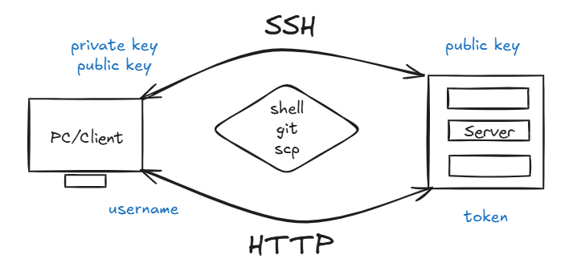

# Computer Remote Connection
## Key Authentication



> **Secure Shell (SSH)** securely connects a client machine to a remote server over a network.

SSH authentication uses a matching **public/private key pair**:
- The **public key** is shared with the remote server.
- The **private key** stays securely on the client machine.
- The server verifies the client's identity using the public key, without receiving the private key.

## SSH Connection
### 1. Generate SSH Keys
Generate a public and private key pair on the client machine.
> Use **ED25519** for most new SSH keys. RSA is also supported when required by an older system.

```bash
ssh-keygen -t ed25519 -C "truong.nguyen4@datalogic.com"
```
| Option | Description |
| --- | --- |
| `-t` | Key type, such as `ed25519` or `rsa`. |
| `-C` | A label for the key, usually an email address. |
The public key is stored in `~/.ssh/id_ed25519.pub`; the private key is stored in `~/.ssh/id_ed25519`.

### 2. Connect to the Server
Add the public key to the remote server's `~/.ssh/authorized_keys` file to enable **passwordless login**.
```bash
ssh user@remote_server
```
| Placeholder | Description |
| --- | --- |
| `user` | Username on the remote server. |
| `remote_server` | Remote server hostname or IP address. |

#### Useful Commands

*Verify the connection*
```bash
ssh -T git@remote_server
```

*Copy the public key to the remote server*
```bash
ssh-copy-id user@remote_server
```

*Show detailed connection logs*
```bash
ssh -vvv user@remote_server
```

## SSH File Transfer
*Copy a Local File to the Server*
```bash
scp /path/to/local/file user@remote_server:/path/to/remote/directory
```

*Copy a Remote File to the Local Machine*
```bash
scp user@remote_server:/path/to/remote/file /path/to/local/directory
```

*Useful `scp` Options*
| Option | Description |
| --- | --- |
| `-r` | Copy directories recursively. |
| `-P` | Specify a non-default SSH port. The default is `22`. |

## JFrog
JFrog CLI lets you **upload, download, search, and manage** artifacts in JFrog Artifactory.
### 1. Install JFrog CLI
```bash
curl -fL https://install-cli.jfrog.io | sh
```

### 2. Create an Access Token
In the JFrog web UI, open **Settings**, generate an **access token**, and store it securely for the CLI configuration.

### 3. Configure the Local CLI
Start the interactive configuration:
```bash
jf config add
```

Use the following values when prompted:
| Prompt | Value |
| --- | --- |
| Server identifier | Choose a unique name, such as `datalogic-jfrog`. |
| JFrog URL | `https://jfrog.devops.datalogic.com` |
| Authentication method | `Access token` |
| Access token | Paste the token generated in the JFrog web UI. |
| Reverse proxy | Enter `n`. |

> If JFrog reports **"couldn't extract payload from Access Token"**, enter your JFrog username when prompted.

Select the configured server profile:
```bash
jf config use server-name
```
Replace `server-name` with the identifier selected during configuration.

### 4. Verify the Connection
```bash
jf rt ping
jf config show
jf config use
```

## JFrog CLI Usage
*Upload an artifact*
```bash
jf rt upload file.zip libs-release-local --flat=false
```

*Download an artifact*
```bash
jf rt download libs-release-local/file.apk ./downloads/
```

*Search a repository*
```bash
jf rt search libs-release-local/
```

*Delete an artifact or directory*
```bash
jf rt delete libs-release-local/android/1.0.0/
```

## GNOME Remote Desktop
GNOME Remote Desktop exposes an **RDP server** on Ubuntu, so the desktop session can be reached from a Windows client with **Remote Desktop Connection**.

### 1. Install GNOME Remote Desktop
```bash
sudo apt update
sudo apt install gnome-remote-desktop -y
```

Enable the RDP backend for the current user:
```bash
grdctl rdp enable
```

### 2. Generate a TLS Certificate
RDP requires a TLS certificate and key. Create a self-signed pair for the host:
```bash
mkdir -p ~/.local/share/gnome-remote-desktop
openssl req -x509 -newkey rsa:4096 \
  -keyout ~/.local/share/gnome-remote-desktop/rdp-tls.key \
  -out ~/.local/share/gnome-remote-desktop/rdp-tls.crt \
  -sha256 -days 3650 -nodes \
  -subj "/CN=$(hostname)"
```
| Option | Description |
| --- | --- |
| `-x509` | Produce a self-signed certificate instead of a signing request. |
| `-newkey rsa:4096` | Generate a new 4096-bit RSA key. |
| `-days` | Certificate lifetime in days. |
| `-nodes` | Store the private key without a passphrase. |
| `-subj` | Certificate subject, here the machine hostname. |

Register the certificate and key with the RDP server:
```bash
grdctl rdp set-tls-cert ~/.local/share/gnome-remote-desktop/rdp-tls.crt
grdctl rdp set-tls-key ~/.local/share/gnome-remote-desktop/rdp-tls.key
```

### 3. Set the Login Credentials
The RDP credentials are separate from the Ubuntu account password.
```bash
grdctl rdp set-credentials USERNAME PASSWORD
```
| Placeholder | Description |
| --- | --- |
| `USERNAME` | Username entered in the RDP client. |
| `PASSWORD` | Password entered in the RDP client. |

Allow the client to control the desktop instead of only viewing it:
```bash
grdctl rdp disable-view-only
```

### 4. Start the Service
```bash
systemctl --user restart gnome-remote-desktop
systemctl --user enable gnome-remote-desktop
```
> `--user` starts the service for the logged-in user. The desktop session must be active for the RDP server to accept connections.

### 5. Verify and Open the Port
*Show the current RDP configuration*
```bash
grdctl status
systemctl --user status gnome-remote-desktop.service
```

*Confirm the server is listening on the RDP port*
```bash
ss -ltnp | grep 3389
```

*Allow RDP traffic through the firewall*
```bash
sudo ufw allow 3389/tcp
```

### 6. Connect from Windows
Open **Remote Desktop Connection** (`mstsc`) and enter the Ubuntu machine's hostname or IP address.
| Field | Value |
| --- | --- |
| Computer | Ubuntu hostname or IP address, such as `192.168.1.10`. |
| Domain | Leave empty unless the machine is domain-joined. |
| Username | Username set with `grdctl rdp set-credentials`. |
| Password | Password set with `grdctl rdp set-credentials`. |

> The self-signed certificate triggers a warning on the first connection. Accept it to continue.
