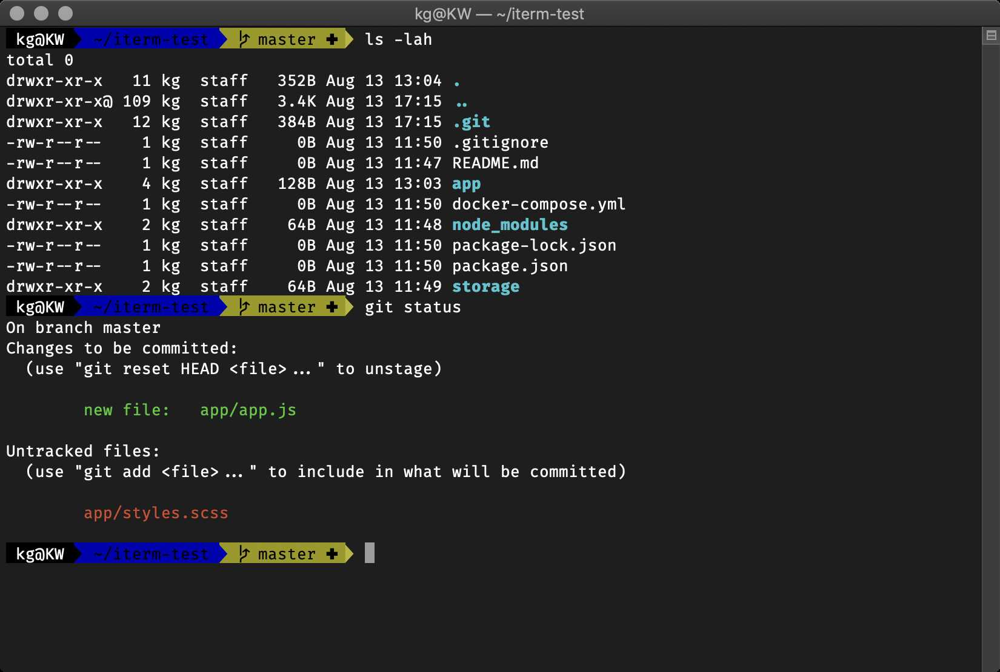
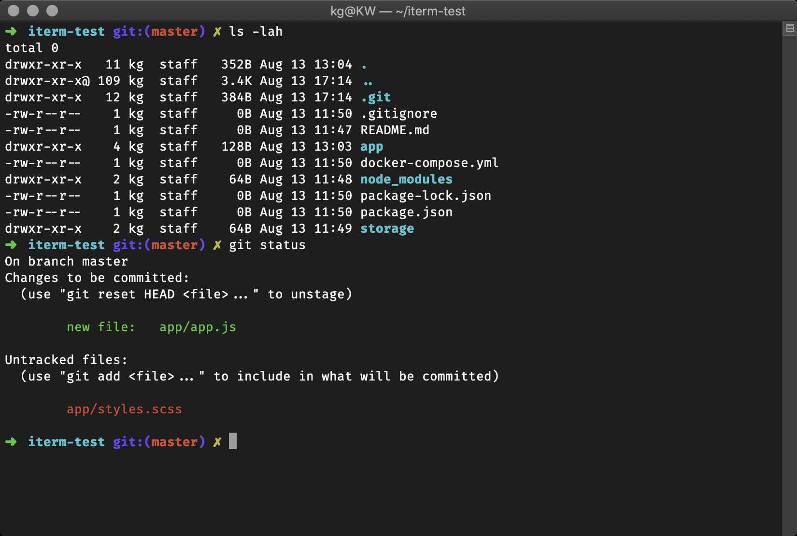
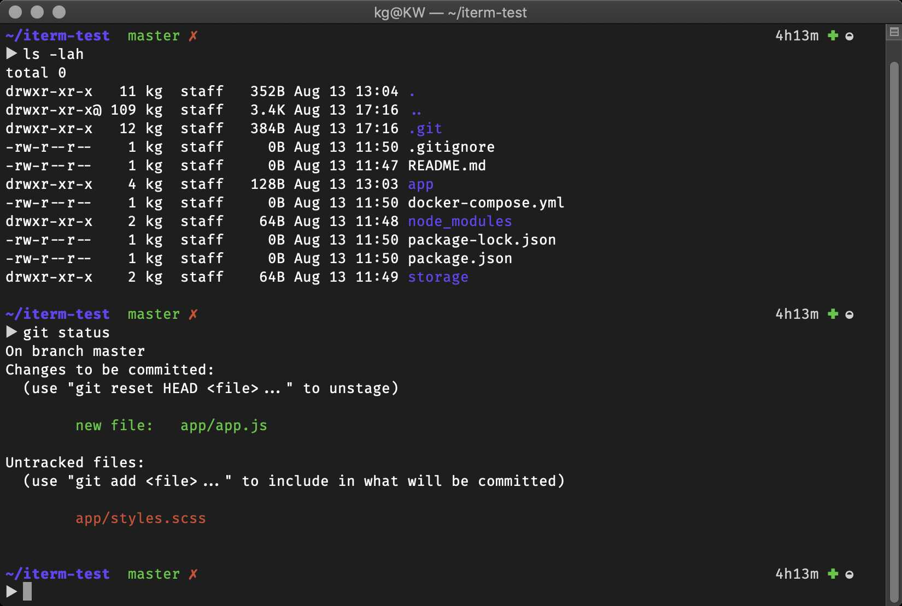
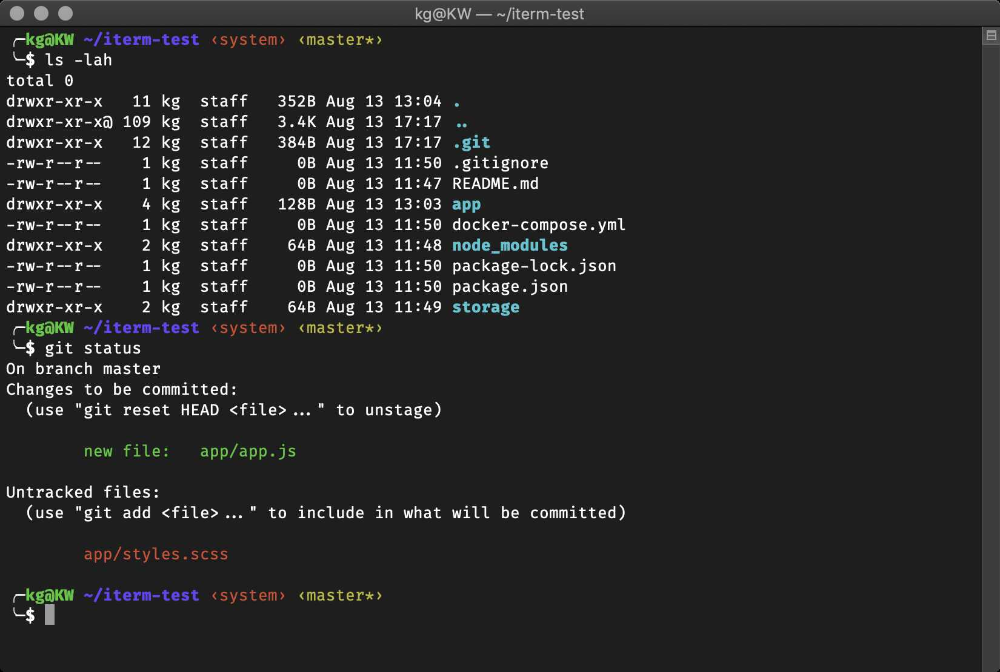
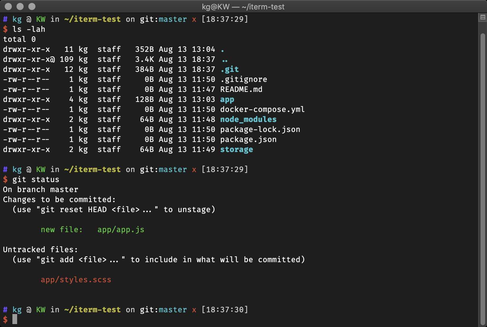
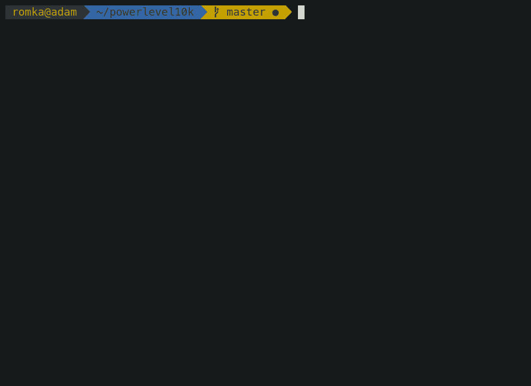
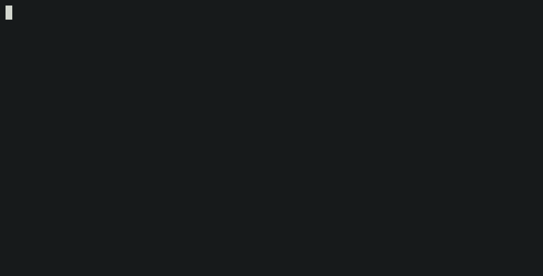

# Shell Terminal
**Zsh** replaces the default Bash shell, and **Oh My Zsh** adds themes, plugins, and sane defaults on top of it.

## Zsh Setup
### 1. Install
- Install Zsh
```bash
sudo apt install zsh -y
```

- Set Zsh as the Default Shell
```bash
chsh -s $(which zsh)
```
| Option | Description |
| --- | --- |
| `-s` | Login shell to assign to the current user. |
| `$(which zsh)` | Full path to the Zsh binary, usually `/usr/bin/zsh`. |

> The new shell applies at the next login. Run `zsh` to start it in the current terminal.

- Install Oh My Zsh
```bash
sh -c "$(curl -fsSL https://raw.githubusercontent.com/ohmyzsh/ohmyzsh/master/tools/install.sh)"
```
| Option | Description |
| --- | --- |
| `-f` | Fail silently on server errors. |
| `-s` | Silent mode, without a progress meter. |
| `-S` | Show errors even in silent mode. |
| `-L` | Follow redirects. |


### 2. Aliases
Aliases are shortcuts for longer commands. Add them to `~/.zshrc`:
```bash
alias images='cd /home/user/images'
alias sr='cd /home/user/scripts'
```

Reload the configuration to apply the changes:
```bash
source ~/.zshrc
```

### 3. Use theme
- Edit `~/.zshrc` and set the desired theme:
```bash
nano ~/.zshrc
```

- Find the line starting with `ZSH_THEME=` and set it to your preferred theme, for example:
```bash
ZSH_THEME="<theme_name>"
```

- Save the file and reload the configuration:
```bash
source ~/.zshrc
```

### 4. Default themes
`agnoster`, `robbyrussell`, `avit`, `bira`, `ys`.

*Agnoster Theme* — powerline segments for user, host, path, and Git branch.


*Robbyrussell Theme* — the Oh My Zsh default, a single arrow with the Git branch.


*Avit Theme* — two lines, with the Git branch and the session time on the right.


*Bira Theme* — two lines, with user, host, path, virtualenv, and Git branch.


*Ys Theme* — one information line with a timestamp, and a bare `$` prompt below.


### 5. Powerlevel10k built-in themes
Oh My Zsh ships around 150 built-in themes. Choose `Powerlevel10k` for a highly customizable and fast prompt.

- Install the Theme
```bash
export ZSH_CUSTOM=${ZSH_CUSTOM:-$HOME/.oh-my-zsh/custom}
git clone --depth=1 https://github.com/romkatv/powerlevel10k.git \
  ${ZSH_CUSTOM:-$HOME/.oh-my-zsh/custom}/themes/powerlevel10k
```

- Enable the Theme: `powerlevel10k`
```bash
ZSH_THEME="powerlevel10k/powerlevel10k"
```

***Configure the Prompt manually***
```bash
p10k configure
```
The wizard asks for a prompt style and writes the answers to `~/.p10k.zsh`. Run it again at any time to change the style.

***Use a Ready-Made Theme***
Powerlevel10k ships with finished prompt configurations, so no prompt settings have to be written by hand. 

- List themes:
```bash
ls ${ZSH_CUSTOM:-$HOME/.oh-my-zsh/custom}/themes/powerlevel10k/config
```

- Copy the chosen style into place and reload the shell:
```bash
cp ${ZSH_CUSTOM:-$HOME/.oh-my-zsh/custom}/themes/powerlevel10k/config/p10k-rainbow.zsh ~/.p10k.zsh
source ~/.p10k.zsh
source ~/.zshrc
```

*Lean, Classic and Rainbow* — `p10k-lean.zsh`, `p10k-classic.zsh`, and `p10k-rainbow.zsh`. A `p10k-lean-8colors.zsh` variant restricts Lean to the 8 base terminal colours.


*Pure* — `p10k-pure.zsh` reproduces the **Pure** prompt.


*Robbyrussell* — `p10k-robbyrussell.zsh` reproduces the Oh My Zsh default prompt.

