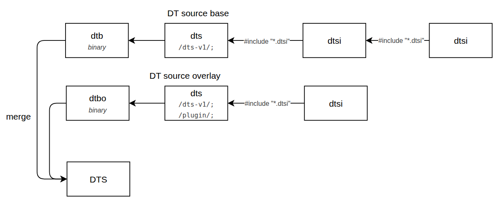

# Device Tree
A **Device Tree (DT)** is a data structure describing the hardware of a board: which controllers exist, at which address, on which IRQ, and with which settings. The kernel does not discover this hardware, it is told about it at boot, so *the device tree decides which driver probes and with what configuration*.

For debugging, two things matter:
- **What the device is actually running** — the merged tree in memory, not the source files.
- **Which source file produced it** — so the fix lands in the right `.dts` / `.dtsi`.

## 1. How It Works


| File | Role |
| --- | --- |
| `*.dtsi` | *Include* fragment. Shared SoC / platform / feature definitions, never compiled alone. |
| `*.dts` (base) | Board source, starts with `/dts-v1/;`. Includes `.dtsi` files and compiles to a **`.dtb`**. |
| `*.dts` (overlay) | Starts with `/dts-v1/; /plugin/;`. Patches an existing tree and compiles to a **`.dtbo`**. |
| `.dtb` / `.dtbo` | The compiled binary blobs shipped inside the images. |

## 2. Source Layout
A product family shares one base and differentiates through overlays and feature fragments.

```text
kernel_platform/qcom/proprietary/devicetree/qcom/
├── tomcat-dvt-qcm.dts            # base board DT        -> .dtb
├── tomcat-dvt-qcm-overlay.dts    # board overlay        -> .dtbo
├── tomcat-dvt-qcm-common.dtsi    # most of the product configuration
├── tomcat-evb-buttons.dtsi       # one feature = one fragment
├── tomcat-nfc.dtsi
└── ...
```

## 4. Identify device tree
### 4.1 Detect device tree in running device
```bash
# Get the board model 
adb shell cat /proc/device-tree/model
# Datalogic VEGA_PLUS DVT WWAN 

# Get the compatible strings
adb shell "cat /proc/device-tree/compatible | tr '\0' '\n'"
# qcom,montague-idp
# qcom,montague
# qcom,idp
```

Search that model / compatible string in the source tree to find the entry point:

```bash
grep -rn "VEGA_PLUS DVT WWAN" --include=*.dts --include=*.dtsi .
# -> vega-plus-dvt-qcm.dts
```

That `.dts` is the root of the running configuration. Following its `#include` chain gives every source file involved.

### 4.2 Dump device tree in running device
```bash
# Pull the live device tree from the running device
adb pull /sys/firmware/fdt live.dtb
# Convert the pulled binary device tree to a human-readable source form
dtc -I dtb -O dts live.dtb -o live.dts
# Also find more information
adb shell ls -la /proc/device-tree/
```

`live.dts` is the **merged** result (base + includes + overlays)

> `/sys/firmware/fdt` is the raw blob handed over by the bootloader. If it is missing, the same content is browsable as files under `/proc/device-tree/` (a symlink to `/sys/firmware/devicetree/base/`).

## 5. Map a Node to Its Driver
The whole point of the DT is the node → driver binding, so check the binding itself.

```bash
# devices created from DT nodes, named <addr>.<node-name>
adb shell ls /sys/bus/platform/devices/

# which driver took a device (missing = nothing probed it)
adb shell ls -l /sys/bus/platform/devices/<dev>/driver

# devices bound to a given driver
adb shell ls /sys/bus/platform/drivers/<driver>/

# back-pointer from the device to its DT node
adb shell ls -l /sys/bus/platform/devices/<dev>/of_node

# i2c / spi equivalents
adb shell ls /sys/bus/i2c/devices/
adb shell ls /sys/bus/spi/devices/
```

### 6.3 Apply an overlay offline
```bash
fdtoverlay -i base.dtb -o merged.dtb overlay.dtbo
dtc -I dtb -O dts merged.dtb -o merged.dts
dtc -I dtb -O dts base.dtb   -o base.dts
diff -u base.dts merged.dts
```

Useful to verify what an overlay really changes before flashing: merge on the host, then diff against the base.

## 8. Command Cheat Sheet
| Goal | Command |
| --- | --- |
| Board name | `cat /proc/device-tree/model` |
| Compatible strings | `cat /proc/device-tree/compatible \| tr '\0' '\n'` |
| Dump live tree | `adb pull /sys/firmware/fdt live.dtb` |
| Decompile | `dtc -I dtb -O dts live.dtb -o live.dts` |
| Compile | `dtc -I dts -O dtb -@ board.dts -o board.dtb` |
| Merge an overlay offline | `fdtoverlay -i base.dtb -o merged.dtb ovl.dtbo` |
| Unpack `dtbo.img` | `mkdtimg dump dtbo.img` |
| Driver bound to a device | `ls -l /sys/bus/platform/devices/<dev>/driver` |
| Devices of a driver | `ls /sys/bus/platform/drivers/<drv>/` |
