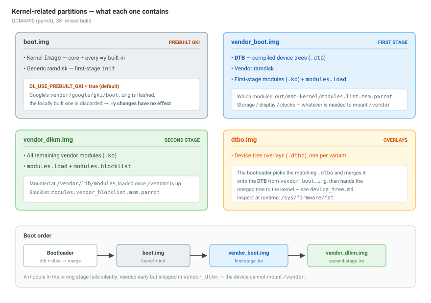
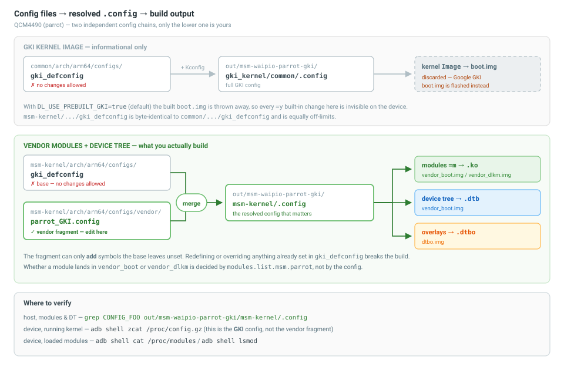

# QCM4490 (parrot) Kernel Build — Overview

Overview notes on how `kernel/kernel_platform` is built: the GKI mixed build, config files, and partitions.

---

## 1. Kernel-related partitions



| Partition | Contents |
|---|---|
| **boot.img** | Kernel `Image` (core + all `=y` modules) + **generic ramdisk** (first-stage `init`) |
| **vendor_boot.img** | **DTB** + **vendor ramdisk** (**first-stage** `.ko` + `modules.load` + ...) 
| **vendor_dlkm.img** | **Second-stage** (`.ko` + `modules.load` + ...) |
| **dtbo.img** | Device Tree Overlays (`.dtbo`) |

## 2. `DL_USE_PREBUILT_GKI` (`vendor/device/qcom/parrot/BoardConfig.mk`)

| Value | boot.img | 
|---|---|
| `true` (default) | Use Google **boot.img** `vendor/google/gki/boot.img` |
| `false` | Use built **boot.img** (from **common**) |

> With `DL_USE_PREBUILT_GKI=true`, `boot.img` is supplied by Google **GKI**. Consequently, changes to modules configured as **built-in**—which would be included in `boot.img`—do not affect the locally built image.

## 3. Configuration structure & build outputs



| File | Role |
|---|---| 
| `common/arch/arm64/configs/gki_defconfig` (❌ No changes allowed) | Builds the **kernel Image (GKI)** |
| `msm-kernel/arch/arm64/configs/gki_defconfig` (❌No changes allowed) | Builds the **kernel Image (GKI)** |
| `msm-kernel/arch/arm64/configs/vendor/parrot_GKI.config` (✅ Changes allowed) | Builds **modules (`.ko`) + DTB/DTBO only** |

## 4. Check commands

### Check on compiled time
| File | Role |
| --- | --- |
| `out/msm-waipio-parrot-gki/gki_kernel/common/.config` | **Full GKI** config |
| `out/msm-waipio-parrot-gki/msm-kernel/.config` | Config used to build **modules + DTB** |
| `.config` | The final resolved config after merging all fragments |
| `out/msm-kernel/modules.list.msm.parrot` | **First-stage** module list|
| `out/msm-kernel/modules.vendor_blocklist.msm.parrot` | Modules shipped in vendor_dlkm.img |


### Check on the device

#### Check config and loaded modules
```bash
# actual running config
adb shell "zcat /proc/config.gz"
# pull the actual running config from the device
adb pull /proc/config.gz .
# decompress the pulled config
gunzip config.gz
# list modules loaded on the device
adb shell "cat /proc/modules"
```

#### Check modules shipped on the device

```bash
# second-stage modules (vendor_dlkm.img, mounted on /vendor)
adb shell "ls /vendor/lib/modules/"
adb shell "cat /vendor/lib/modules/modules.load"
adb shell "cat /vendor/lib/modules/modules.blocklist"
```

```bash
# first-stage modules (vendor_boot ramdisk, kept in the rootfs after boot)
adb shell "ls /lib/modules/"
adb shell "cat /lib/modules/modules.load"
```

#### Unpack the images

Images come either from the build (`$O/dist/*.img`) or from the device. On an A/B device the `by-name` links carry a slot suffix, so find the active slot first:
```bash
# root the shell: adb root on userdebug, su -c on a rooted user build
adb root
adb shell getprop ro.boot.slot_suffix     # _a or _b
adb shell ls -l /dev/block/by-name/ | grep -iE "boot|dtbo"
```

```bash
# dump the vendor_boot.img
adb exec-out "dd if=/dev/block/by-name/vendor_boot_a" > vendor_boot.img
# unpack it: prints the header, writes vendor_ramdisk + dtb
unpack_bootimg --boot_img vendor_boot.img --out out_vendor_boot
ls out_vendor_boot
# the first-stage modules live inside the ramdisk
lz4cat out_vendor_boot/vendor_ramdisk | cpio -idmv
ls out_vendor_boot/lib/modules/
cat out_vendor_boot/lib/modules/modules.load
```

```bash
# dump the vendor_dlkm.img
adb exec-out "dd if=/dev/block/mapper/vendor_dlkm" > vendor_dlkm.img
# a dd from the device is already raw ext4; a build output is usually sparse
file vendor_dlkm.img
simg2img vendor_dlkm.img vendor_dlkm.raw   # only if file says "Android sparse image"
# check the contents in vendor_dlkm.img
debugfs -R "ls -l /lib/modules" vendor_dlkm.raw
```
```bash
# dump boot.img
adb exec-out "dd if=/dev/block/by-name/boot_a" > boot.img
# unpack it: writes kernel + generic ramdisk
unpack_bootimg --boot_img boot.img --out out_boot
strings out_boot/kernel | grep -m1 "Linux version"
```
